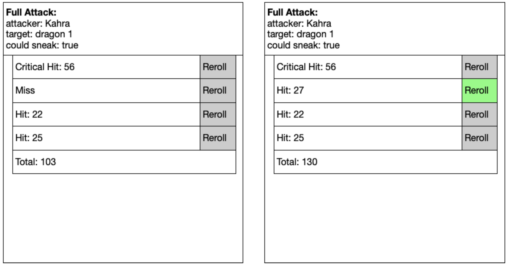

# Dice Rolling Language
by Drew Hilton

https://docs.google.com/document/d/1QUdw6X47yEjJmwKtfGkZNFKohwHhmbEoQ6j7jER7DqA/edit

## Example
Here is a vague[^1] example of what might go into the dice rolling language.  This code roughly represents what is needed for an attack roll in D&D (pardon the poor capitalization etc—I dashed this off in Gdocs, which is not meant for writing code)

[^1]:By which I mean, I have not thought carefully about the syntax, language features etc… but this does have a significant set of features

```java
deftype rollwithmod {    //this might be built in?
   numdice:int,
   numsides:int,
   modifier:int,
}
deftype attack {
    basedmg: rollwithmod,
    attackbon: int,
    rerolls: int,  //typical = 0, = roll once.  Positive = reroll for higher, neg = reroll for lower
    critthreat: int,
    autoconfirm: bool,  //might be more complex than that
    addoncrit : rollwithmod,
    addonsneak: rollwithmod,
    addoncritsneak:rollwithmod,
}
deftype buff{
    name: string,
    amount: int,
    active: bool
}
deffype creature{
    attacks: attack list,
    Attackbuffs: buff list,
    ac: int,
    missChance: int,
    critreduce: int
    sneakreduce: int,
    hascritnegate :bool,
    hassneaknegate:bool,
    sritovercome:int,
    sneakovercome:int,
    canAddReroll: bool,
    rerollbonus: int,
    canForceReroll: bool,
    forcererollpen: int,
}
Deffun rollwithmod(r: rollwithmod) {
    Ans = roll(r.numdice + “d”+r.numsides ); //maybe we have a function that is just like d(nd,ns)?  
    return Ans + r.modifier
}
deffun   oneAttack(target: creature, attacker: creature, whichattack:attack, couldsneak: bool) {
    tohit = roll(“d20”);
    recount = whichattack.rerolls;
    abon=whichattack.attackbon;
    For (b : attacker.attackbuffs ){
        if  (b.active) {
            abon += b.amount;
        }
    }
    If (attacker.canAddReroll){
        If (userOption (attacker, “Reroll?”)) {  //provide a place to ask the player to reroll 
            recount++;
            abon += rerollbonus;
        }
    }
    If (target.canForceReroll) {
        If (userOption(target, “Force Reroll?”)) {   //this goes to a different user though
            recount–;
            abon -= forcererollpen;
        }
    }
    While (recount > 0) {
        Temp = roll(“d20”);
        Tohit = max(temp, tohit);
        recount –;
    }
    while(recount <0){
        Temp = roll(“d20”);
        Tohit = min(temp, tohit);
    }
    if(tohit == 1) {  //always miss
        output(“Miss (natural 1)”);
        return 0;
    }
    If (tohit != 20 && tohit + abon < target.ac) {
        output(“Miss (AC)”);
        Return 0;
    }
    If (roll(d100) <= target.missChance) {
        output (“Miss (miss chance)”);
        Return 0;
    }
//at this point it is a hit.  Figure out if it is a crit and sneak
    crit= false
    If (tohit >= whichattack.critthreat) {
    //might be a crit.
        If (whichattack.autoconf || roll(“d20”) + abon >= target.ac) {
        //confirmed crit—check crit reduction and negation
            if( roll(d100) > target.critReduce) {
                If (!target.hascritnegate || !userOption(“Negate Crit?”)) {
                    crit = true;
                }
            }
        }
        sneak = couldSneak && roll(d100) > target.sneakReduce && (!target.hassneaknegate || !userOption(“Negate Sneak Attack?”));
        Dmg = rollwithmod(whichattack.basedmg);
        Descr=”Hit”;
        If (sneak){
            Dmg += rollwithmod(whichattack.addonsneak);
            Descr=”Sneak Attack”;
        }
        If (crit) {
            Dmg += rollwithmod(whichattack.addoncrit);
            Descr=”Critical Hit”;
        }
        If (crit && sneak){
            Dmg += rollwith mod(whichattakc.addoncritsneak);
            Descr=”Critical Sneak Attack”;
        }
        output(Descr + Dmg);  //string concatenation
        return dmg;
    }//end function

defroll “Full Attack” fullattack(target:creature, attacker: creature, couldsneak:bool) {
    total=0
    for(a : attacker.attacks) {
        startGroup();
        total += oneAttack(target, attacker, a, couldsneak);
        endGroup();
    }
    output(“Total damage: “ + total);
}//end roll

```

## Explain
Believe it or not, that is actually a somewhat oversimplified version of what happens, but suffices for our purposes here (it shows the features that are generally needed, or at least gives us a point to talk about them).

I’ll note that this example suggests several things that need to be done in the programming language and communicated to the UI and database.

- Extract types and rolls.   The UI will need to display a place for players to put in information (e.g. about their own character , or the monsters) and keep it.    The UI will also need to display which rolls are available, so that players can choose what to do
- Output of a roll calculation may be many lines—note there are many calls to output.  I am thinking we might want coloring and/or other formatting features available but haven’t though them through yet
- Input/decisions after a roll.    I called a function called “userOption”  (which probably needs more variants/more descriptiveness) but roughly imagined that when you encounter this during the first execution of a roll, you execute as if it returned false.  However, you also need to note that it was encountered, and communicate that information with the results, so that the user can choose to do that action (reroll the roll or whatever) and then do a deterministic re-execution where it gets changed to true

- I’ll note that this is a “what might the output look like” sketch for a “before and after’.  On the left, the player sees their initial results.  They decide to use a reroll on the Miss, so click that and thing get redone, shown on right.   



Note that all other random numbers stayed the same—the only thing that changed was the result of the “if” for the userOption of the reroll, and also new random numbers.

Let us consider for just a second:
```java
X = roll(“d20”)  //red die
If (something) {
   Y = roll(“d20”) //blue die
}
Z = roll(“d20”) //green die

```

Basically, if we execute this once and X=4 and Z=17, and the condition is false (so we don’t compute Y), then if we re-execute this changing the condition to true, we want to ensure that X=4, Z=17, and Y is some newly made random number (lets suppose 12).  If we then change the condition back to false, we should again get X=4, and Z=17. Switching back to true should once again yield X=4, Y=12, and Z=17.

Just picking the same random seed at the start of the execution is a starting point, but not the entire story—that would ensure that X is 4, but when we make the condition true, we would probably be Y=17 and not Z=17.

Instead, what we will do is, during execution we will build up a string that represents where we are in the execution and how we got there.  This string will contain information about control constructs, namely if and while, and rolls performed.   In particular,

- When we reach an if,  we push the current string on the stack.
  - If the condition is true, we append a “t” for the execution of the code inside the then block
  - If the condition is false, we append and “f” for the execution of code inside the else block
  - At the end of the if/else, we pop the stack and add an “i”
- When we reach a while, we push the string on the stack
  - At the start of each iteration, we append a “w” to the string
  - At the end of the loop, we pop the stack, and append an “L” to the string
- Whenever we do a roll, we add an “r” to the string
- Whenever we reach user input, we append a “u” to the string

For example:

```java
   //—- string is “”
X = roll(“d20”)
   //—- string is “r”    (added an r because we did a roll)
If (something) {
   //— string is “rt“    (inside true part of if)
   Y = roll(“d20”)
    //—string is “rtr”    (did a roll)
        }
    //—- string is “ri”   (popped “r” from stack, appended “i” for completed if)
    Z = roll(“d20”)
    //—-string is “rir”    (did another roll, so add an “r”)

```

This string will then let us uniquely identify any roll (X: “”, Y: “rt”, Z: “rir”), as well as any user input.   We could imagine doing something fancy with seeds and hash functions (like actual seed = random seed ^ hash(string)), but it is much easier to just keep a hashmap string -> int and use it to remember any roll we have already done.   We can also use this to keep track of user input (have they picked something for userOption?) by uniquely identifying those as well.
